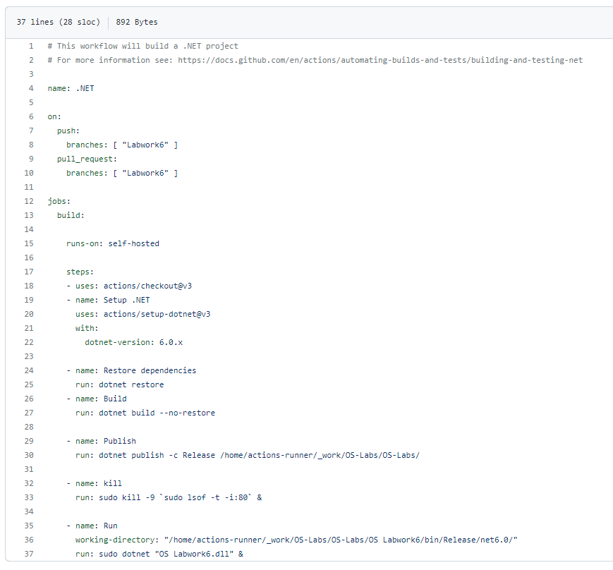

# Лабораторна робота №4
## Виконав студент 3 курсу ІПЗ, 1 групи, Кіш Роберт Робертович

## План:
Create terraform scenario for provisioning infrastructure on GCP (or AWS) cloud Requirement 
1. Create one instance (image: ubuntu 20.04) 
2. Allow HTTP/HTTPS traffic on a NIC 
3. Provision one SSH public key for created instance 
4. Install Web Server (Apache HTTP Server / NGINX HTTP Server) via bash scenario

## Хід Роботи
Створив ключ SSH, завантажив його та вставив в конфігурацію.\

\
Дозвіл HTTP/HTTPS трафіку в конфігураційному файлі:\
\
Створення необхідного інстансу в конфігураційному файлі:\
\
Встановлення веб серверу за допомогою bash скрипта:\

