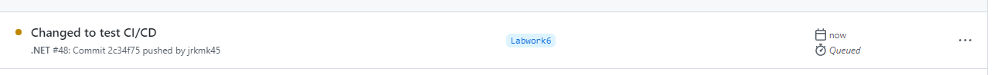
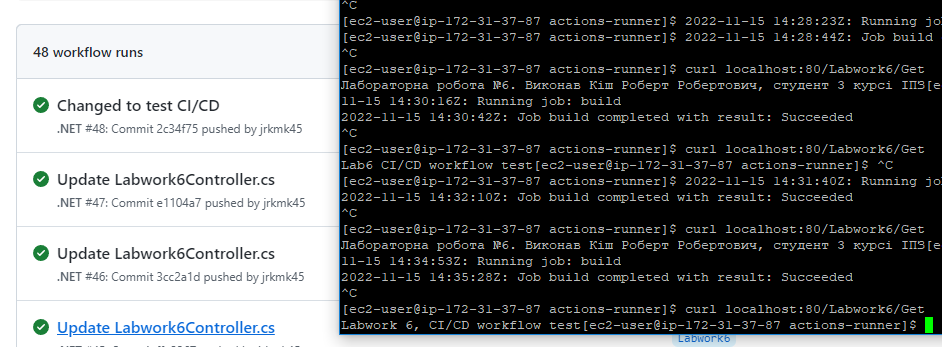

# Лабораторна робота №6
## Виконав Кіш Роберт Робертович, студент 3 курсу ІПЗ, 1 група.

## План:
1. Ознайомитись із поняттями CI/CD та GitHub Actions. 
2. Задеплоїти проект на EC2 або VPS(за наявності) за допомогою GitHub Actions.
3. Ознайомитись із github pipelines та використати їх для реалізації CI/CD.

## Хід роботи
## Ознайомитись із поняттями CI/CD та GitHub Actions. 

CI/CD - це практика безперервної інтеграції та деплою. Суть в тому, що коли розробник допрацював або переробив якусь частину програми, закомітив, запушив або запустив збірку власноруч, вона відразу інтегрується та деплоїться на сервер зі всіма змінами.

GitHub Actions - система безперервної інтеграції, яка доступна для репозиторіїв на Github.

## Задеплоїти проект на EC2 або VPS(за наявності) за допомогою GitHub Actions. Ознайомитись із github pipelines та використати їх для реалізації CI/CD.

На AWS створив інстанс з лінуксом, та підключився до його терміналу через Putty
На інстансі створив раннер виконуючи команди з документації:\
\
\

Створив файл workflow.yml в директорії .github/workflows/workflow.yml та наповнив його таступним вмістом:
\
runs-on: self-hosted значить що дії будуть виконуватись на ранері який був створений, тому що в нього є тег self-hosted\

Перед запуском проекту потрібно видалити процес який займає порт 80, й запустити dll файл, перебуваючи в директорії я кому він сам є.

Від цього моменту при будь яких комітах та пушах в гілці Labwork6 будуть виконуватись інструкції які є в файлі workflow.yml

Для того щоб відбувались зміни на хмарі необхідно запустити runner який був створений:\
cd /home/actions-runner/
sudo ./run.sh &

Перед маніпуляціями в репозиторій залив простий asp.net core проект для тесту з контроллером який повертає строку.
Результат:
\
Комічу зміни для тесту, змінюю рядок який повертає контроллер:
\
Гітхаб побачив зміни та створив action.
\
Результат: зміни відбулися, контроллер повертає інше значення.

