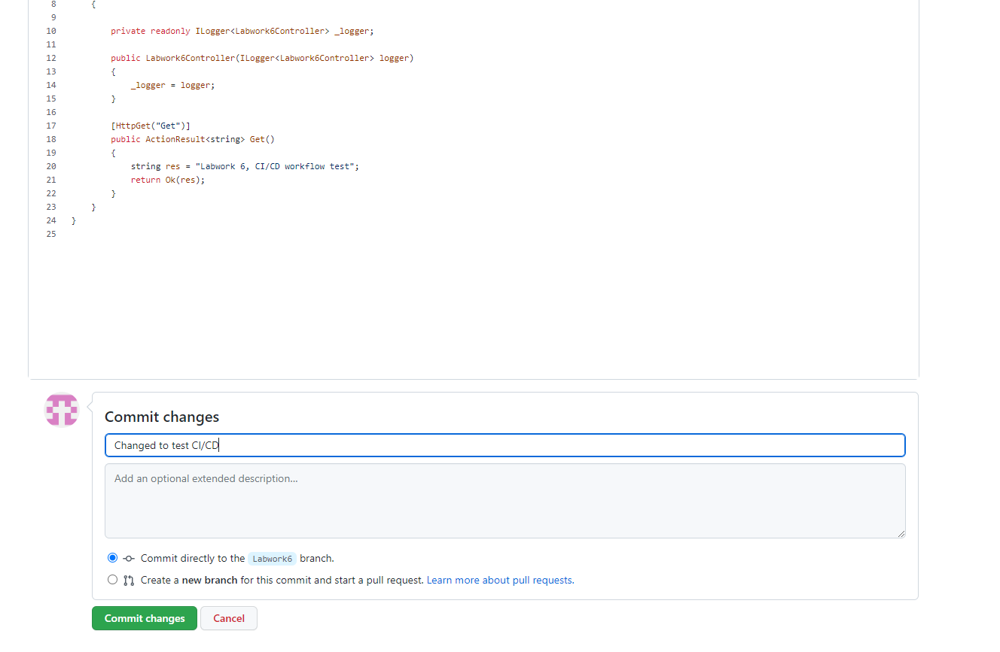

# Лабораторна робота №5
## Виконав студент 3 курсу ІПЗ, 1 групи, Кіш Роберт Робертович

## План:
Лабораторна робота №5. Деплой проекту на AWS EC2.
План:\
Зареєструватись на AWS. \
Створити інстанс EC2.\
Задеплоїти проект (може бути  html сторінка) і скинути посилання в звіт для можливості перегляду.

## Хід Роботи
В лабораторній роботі №4 був створений сценарій тераформу для створення інфракструктури в хмарі AWS: https://github.com/jrkmk45/OS-Labs/tree/Labwork4  
**Задеплоїний проект доступний за адресою 18.197.75.18**
Задеплоїв проект наступним чином:\
В терміналі в папці конфігураційних файлів тераформ виконав наступні команди:\
terraform init\
terraform validate\
terraform plan\
terraform apply\
Результат виконання:
\

### Отже на основі конфігурацій створився інстанс на aws
Змінив вміст html файлу, отримавши доступ до терміналу інстансу.\
\
\
Перейшовши за адресою створеного ресурсу 18.197.75.18 отримав наступний результат:\

