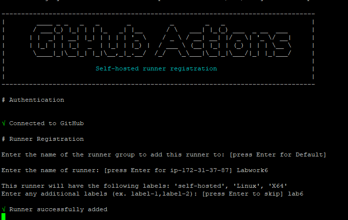
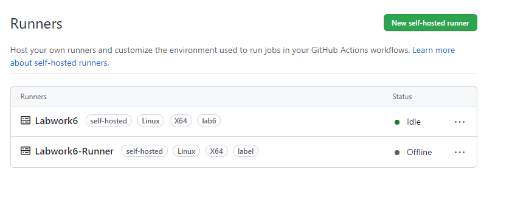
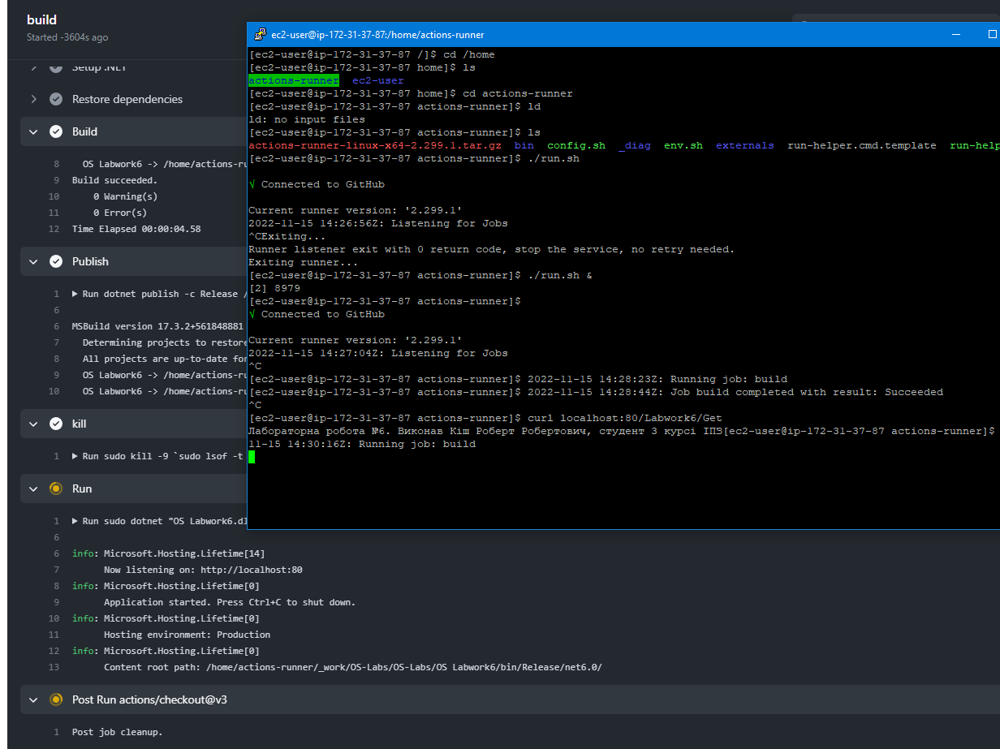

# Лабораторна робота №3

## Виконав студент 3 курсу ІПЗ, 1 групи, Кіш Роберт Робертович

## План:
1. Використання готових Docker Images.
2. Використання Docker Compose.
3. Створення HTML сторінки та занесення її в Docker Image. Залити даний Docker Image на Docker Hub.
4. Скачати Docker Image когось із групи і розвернути в себе контейнер з HTML сторінкою на порті 8086 ззовні.

## Хід Роботи

### 1. Використання готових Docker Images.	
Ознайомитись із готовими Docker Images які знаходяться на Docker Hub. Використати образ wordpress та розвернути сайт із безкоштовною темою.

Для розвертанная сайту на базі Wordpress в Docker був створений docker-compose.yml файл з наступним вмістом:

Була виконана команда docker compose up для створення образів:\

\
За адресою localhost:8080 отримав доступ до CMS WordPress та створив сайт.

### 2. Використання Docker Compose. Описати теоретично що таке Docker Compose, чому саме розширення .yml а також навести переваги та недоліки його використання. Навести приклад створення та збирання образа за допомогою Docker Compose.
 

### Описати теоретично що таке Docker Compose
docker compose - інструмент, який дозволяє керувати декількома контейнерами, які є одним проектом. Конфігурація docker compose міститься в файлі docker-compose.yml

### Чому саме розширення .yml
.yml - документ в якому використововують мову YAML. YAML - мова серіалізації даних, яка зазвичай використовується для написання конфігураційних файлів. YAML є легко читебельною мовою та спроможна об'єднувати велику кількість мов програмування.

### Переваги .yml:
1. Легка вага та легка читабельність документу через відсутність різділювачів.
2. Сумісність з системою контролю версій.
3. Парсер YAML підтримує парсинг JSON.

### Недоліки .yml:
1. YAML менш популярний ніж XML та JSON.
2. Багато додатків які були побудовані на основі XML та JSON тому важко замінити їх на YAML.
3. Існують додаткові застереження під час написання коду YAML. Навіть якщо ви неправильно вставите один пробіл під час відступу, ваш код може перестати працювати.
4. Існує багато способів для побудови ієрархії даних за допомогою YAML, тому це важко для обробки для ПК, XML та JSON більш продуктивні.

### Навести приклад створення та збирання образа за допомогою Docker Compose
Створити конфігурацію в конфігураційному файлі docker-compose.yml, використовуючи команду docker compose up для розвертання контейнерів на основі файлу конфігурації. 

### 3. Створення HTML сторінки та занесення її в Docker Image.
Створив Dockerfile та html сторінку з необхідним вмістом.
 

Виконав команду для створення образу.\
\
Запустив контейнер на основі образа

Результат:

### Залити готовий образ на Docker Hub

Авторизувався через консоль на Docker Hub
Для заливання образу на Docker Hub виконав наступні команди:\

\
Результат: \

### 4. Скачати Docker Image когось із групи і розвернути в себе контейнер з HTML сторінкою на порті 8086 ззовні.
Образ студента Варі Іштвана Степановича: https://hub.docker.com/repository/docker/istvanvari/lab3  
Запулив Docker Image з віддаленого репозиторію:\
\
Запустив його в контейнері:\
\
Результат:\

